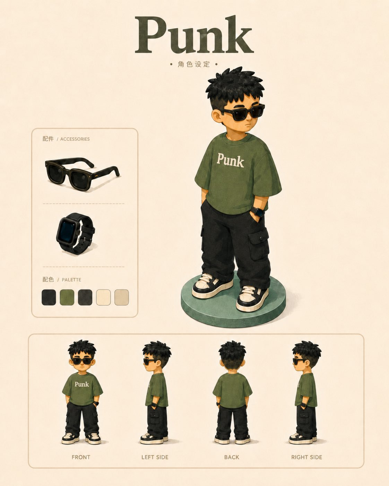
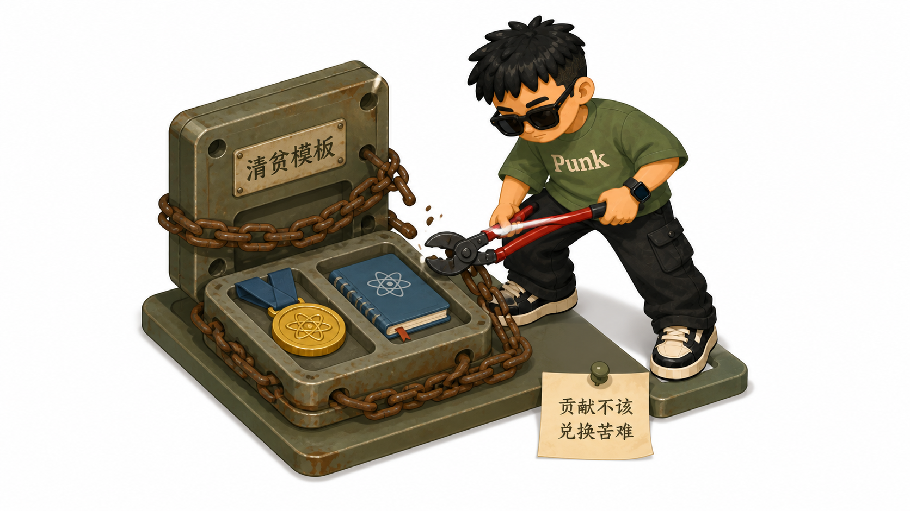
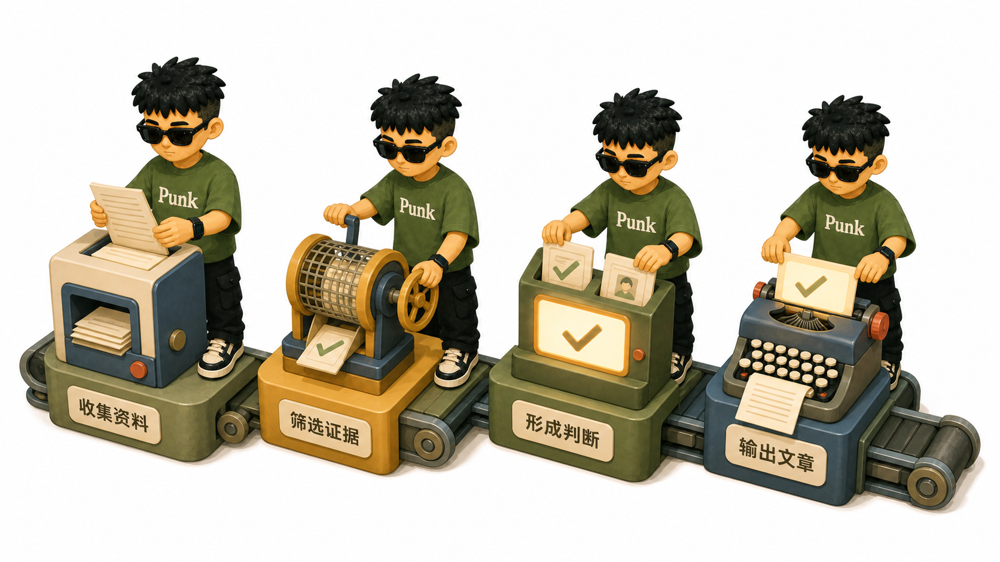

# Punk IP Article Illustrations

使用固定的 **Punk 个人 IP**，把完整文章自动拆解为一组统一、克制、可直接插入正文的复古彩色扁平 3D 插图。

这个 Agent Skill 会先读完文章，再按信息密度决定画几张、画什么以及放在哪里。它不是“一篇文章只生成一张图”，也不会把多张图拼成一张信息图。

<p align="center">
  
</p>

## 效果展示

<table>
  <tr>
    <td width="50%"></td>
    <td width="50%"></td>
  </tr>
  <tr>
    <td width="50%"></td>
    <td width="50%"></td>
  </tr>
</table>

## 它会自动完成什么

- 完整读取文章、Markdown、网页正文、帖子或单个观点。
- 提炼核心判断、关键机制、认知转折和行动结论。
- 按文章长度与信息密度自动决定配图数量。
- 为每张图选择独立的认知锚点，避免重复表达同一个意思。
- 自动判断使用“核心动作”还是“流程拆解”。
- 严格复用内置 Punk 角色的发型、墨镜、服装、鞋子、手表和身体比例。
- 将每张插图单独生成并保存，最后报告用途、绝对路径和建议插入位置。
- 默认不修改原文，也不会覆盖已有图片。

## 自动配图数量

| 文章规模 | 默认数量 |
| --- | ---: |
| 单个观点或 500 字以内 | 1 张 |
| 约 500—1500 字 | 1—3 张 |
| 约 1500—3500 字 | 3—5 张 |
| 约 3500 字以上 | 4—8 张 |

字符数只作参考。Skill 会合并重复段落，不会为了凑数量制造无效插图；用户明确指定数量时，优先遵循用户要求。

## 两种画面模式

### 核心动作

适合观点、判断、冲突、处境和反直觉关系。画面只保留一个 Punk、一个核心物件或紧凑物件组、一个明确动作和一个可见结果。

### 流程拆解

适合步骤、方法、工作流和输入到输出的完整链路。内容会被压缩为 3—5 个关键节点，同一个 Punk 可以在不同节点重复出现，但每个分身都必须承担具体动作。

两种模式都使用 16:9 横版、纯白页面、大面积留白和复古彩色扁平 3D 小剧场风格。

## 安装

### 让 AI Agent 自动安装

把下面这段话发送给能够访问终端和文件系统的 AI Agent：

```text
请帮我安装这个 Agent Skill：
https://github.com/adrianpunk/punk-ip-illustrations

请根据我当前使用的客户端确定正确的 Skills 安装位置，只安装仓库中的 punk-ip-article-illustrations，并在安装后确认它可以使用。
```

### 手动安装到 Codex

macOS / Linux：

```bash
git clone https://github.com/adrianpunk/punk-ip-illustrations.git ~/.codex/skills/punk-ip-article-illustrations
```

Windows PowerShell：

```powershell
git clone https://github.com/adrianpunk/punk-ip-illustrations.git "$HOME\.codex\skills\punk-ip-article-illustrations"
```

如果你使用的客户端不是 Codex，请把仓库克隆到该客户端对应的 Skills 目录，并确保目录名为 `punk-ip-article-illustrations`。

## 快速开始

### 为完整文章自动配图

```text
使用 $punk-ip-article-illustrations。
请完整读取这篇文章，自动决定配图数量并直接逐张生成。
不要修改原文，告诉我每张图片适合插在哪里：

<文章地址、文件路径或完整正文>
```

### 为单个观点生成一张图

```text
使用 $punk-ip-article-illustrations，为下面这个观点生成一张核心动作模式插图：

<主题或观点>
```

### 指定配图数量

```text
使用 $punk-ip-article-illustrations，完整读取下面的文章并生成 5 张插图：

<文章地址、文件路径或完整正文>
```

## 输出结果

图片默认保存在当前项目根目录：

```text
.punk-ip-assets/<article-slug>/
```

没有可写项目目录时，回退到：

```text
~/.punk-ip-assets/<article-slug>/
```

文件按文章顺序命名，例如：

```text
01-old-template.png
02-value-over-price.png
03-different-paths.png
```

同名文件已存在时会自动创建 `-v2`、`-v3` 版本，不覆盖旧图。

## 使用要求

- AI Agent 支持 Agent Skills 和本地文件读写。
- 客户端具备图像生成能力；否则 Skill 只能输出可执行提示词和保存计划。
- 使用网页链接时，Agent 需要能够访问网页正文。
- 图像模型需要支持使用人物参考图，才能获得更稳定的 IP 一致性。

## 安装后的最小测试

先用下面两个小任务确认 Skill 能读取人物参考、选择模式、调用图像生成工具并报告实际路径。

### 核心动作冒烟测试

```text
使用 $punk-ip-article-illustrations，把下面观点生成一张核心动作模式正文插图：
真正的效率不是同时做更多事情，而是减少无效切换。
```

预期结果：生成 1 张独立的 16:9 PNG；纯白背景；只有一个 Punk、一个核心动作和一个可见结果；手表位于角色本人左手腕；回复包含实际本地路径和建议插入位置。

### 流程拆解冒烟测试

```text
使用 $punk-ip-article-illustrations，把“收集资料 → 筛选证据 → 形成判断 → 输出文章”生成一张流程拆解模式正文插图。
```

预期结果：生成 1 张 16:9 PNG；包含 3—5 个清楚节点；同一 Punk 可重复出现但身份一致；没有米色设定板背景、标题、配件框、色板或复杂 PPT 卡片。

## 常见失败与处理

| 问题 | 处理方式 |
| --- | --- |
| 出现米色背景、`Punk` 大标题、边框或色板 | 只使用 `punk-character-reference-clean.png`，移除设定板参考后重试 |
| 手表跑到错误手腕 | 明确“角色本人左手腕；正面视角通常在画面右侧”，只修正佩戴侧 |
| 人物长相或服装漂移 | 重新传入干净人物参考；需要侧背角度时再加入完整设定板 |
| 画面像海报、PPT 或复杂信息图 | 删除第二隐喻、大标题和完整空间背景，只保留一个关系与 1—3 个物件 |
| 图片中文字错误 | 减少非必要文字，优先使用短物件标签；必要时重新生成该张 |
| 无法写入 `.punk-ip-assets/` | 使用图像工具返回的实际本地路径，并在最终回复中原样报告 |

## 项目结构

```text
punk-ip-illustrations/
├── SKILL.md
├── agents/
│   └── openai.yaml
├── assets/
│   ├── punk-character-reference-clean.png
│   └── punk-character-sheet.png
├── references/
│   ├── article-workflow.md
│   ├── character-spec.md
│   ├── illustration-style.md
│   └── tool-workflow.md
└── docs/
    └── images/
```

## 角色与画风

Punk 角色固定保留：黑色刺感短发、黑色方框墨镜、橄榄绿 `Punk` T 恤、黑色工装裤、黑白厚底运动鞋，以及角色本人左手腕上的黑色智能手表。新图默认使用透明背景的干净单人物参考；完整设定板只在需要侧面或背面角度时辅助使用。

画面固定使用复古彩色扁平 3D 编辑插画风格：纯白背景、主体约占画面 55%—65%、轻等距视角、哑光低细节、柔和阴影，以及橄榄绿、芥末黄、复古蓝、珊瑚红等克制配色。

## 隐私

仓库只包含公开工作流、Punk 角色设定图和展示插图，不包含测试文章正文或本机私人路径。使用本地文章时，原文默认只读，不会被复制进输出目录。

## 授权与致谢

- Skill 工作流和文档按 [MIT License](LICENSE) 发布。
- Punk 人物设定图及角色资产不包含在 MIT 授权中，详见 [LICENSE-ASSETS](LICENSE-ASSETS)。
- 工作流结构基于 [jinchenma94/jinchenma-ip-skills](https://github.com/jinchenma94/jinchenma-ip-skills) 的开源思路修改，感谢金尘马的分享。

## 反馈

如果遇到安装、人物一致性、文字准确性或文章锚点选择问题，欢迎提交 [GitHub Issue](https://github.com/adrianpunk/punk-ip-illustrations/issues)。提交前请移除私人文章、照片和其他敏感信息。
